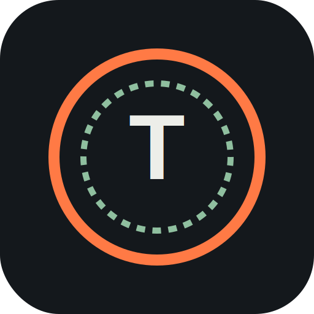
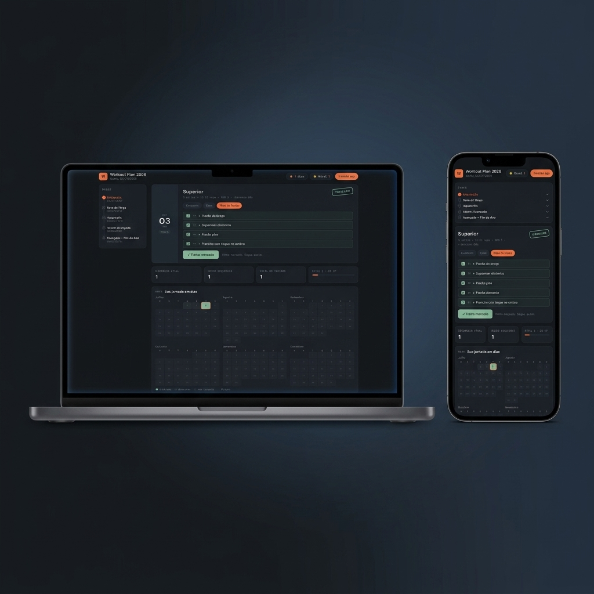

<h1 align="center"> Workout Plan 2026</h1>

    

   
   
      

## 🧩 Project

**Workout Plan 2026** é um PWA (Progressive Web App) gamificado criado para registrar e acompanhar o seu plano de treino de forma diária e interativa durante o ano de 2026.

O aplicativo foi construído focado em consistência e motivação, utilizando mecânicas de gamificação como níveis, experiência (XP) e medalhas de conquistas.

## ⚙️ Features

- 🏋️‍♂️ **Fichas de Treino**: Alternância rápida entre diferentes modalidades de treino (Academia, Casa e Peso do Corpo).
- ✅ **Check-in Interativo**: Botão dinâmico com animação de carimbo (stamp) ao concluir e registrar o treino do dia.
- 🎮 **Gamificação**:
  - Acúmulo de XP (pontos de experiência) ao treinar e completar sequências (streaks).
  - Sistema de níveis com animações de subida de nível.
- 📅 **Calendário Anual**: Mapa completo de treinos mostrando a consistência semanal e mensal.
- 🏆 **Conquistas (Achievements)**: Medalhas desbloqueáveis conforme o progresso e consistência dos treinos.
- 📱 **PWA (Progressive Web App)**: Instalável em dispositivos móveis e desktops, com suporte offline via Service Worker.
